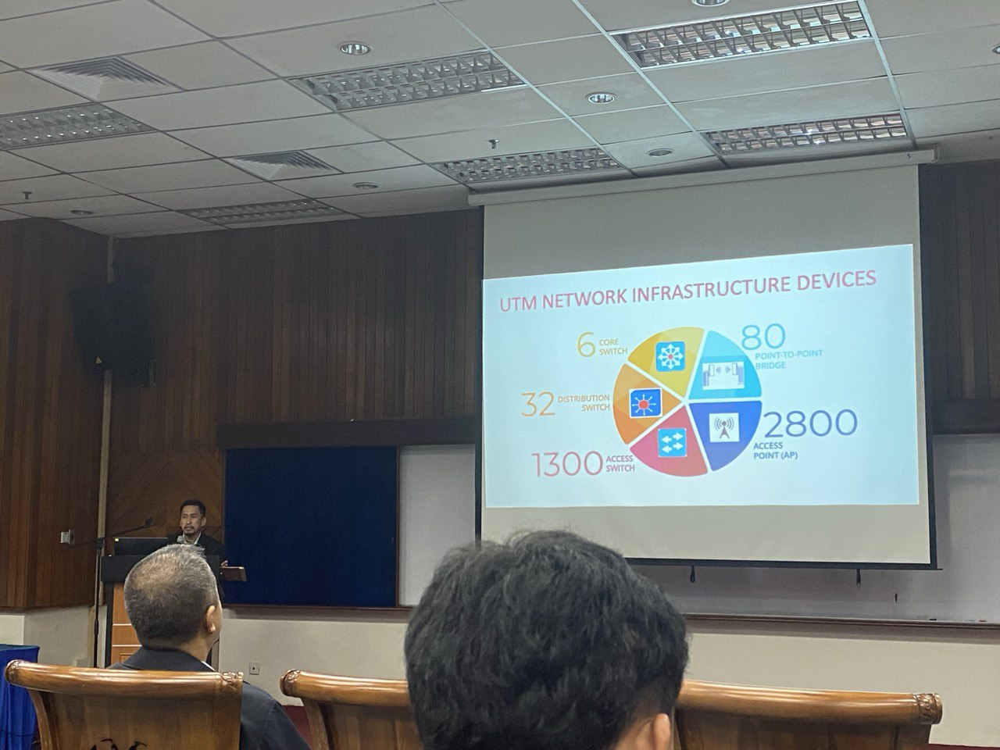
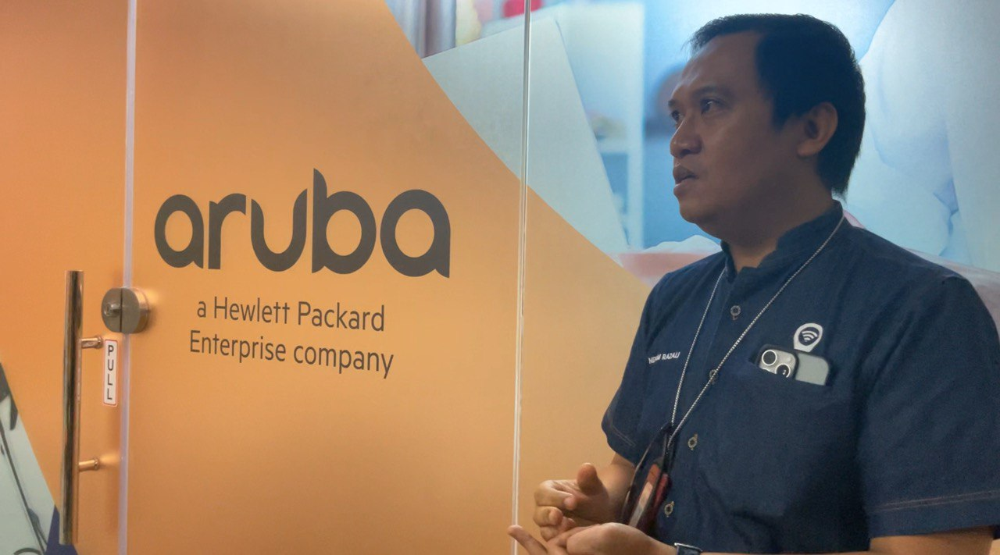
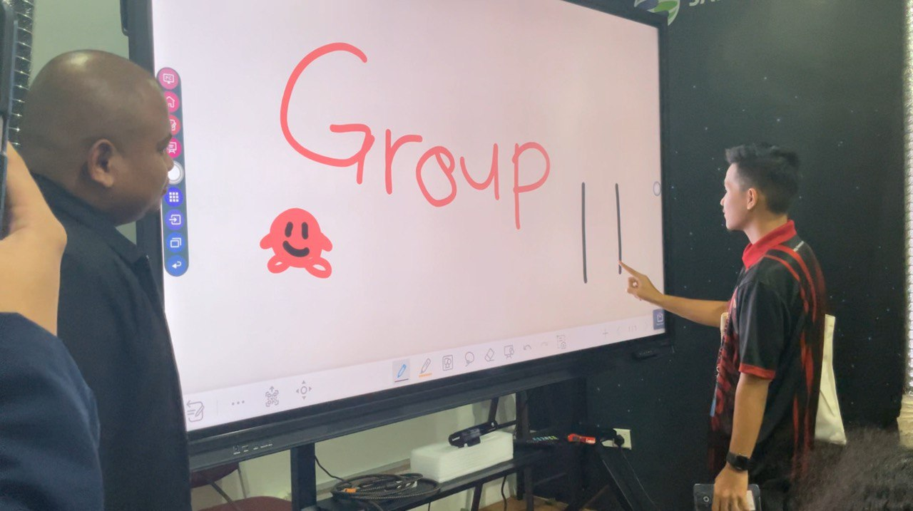
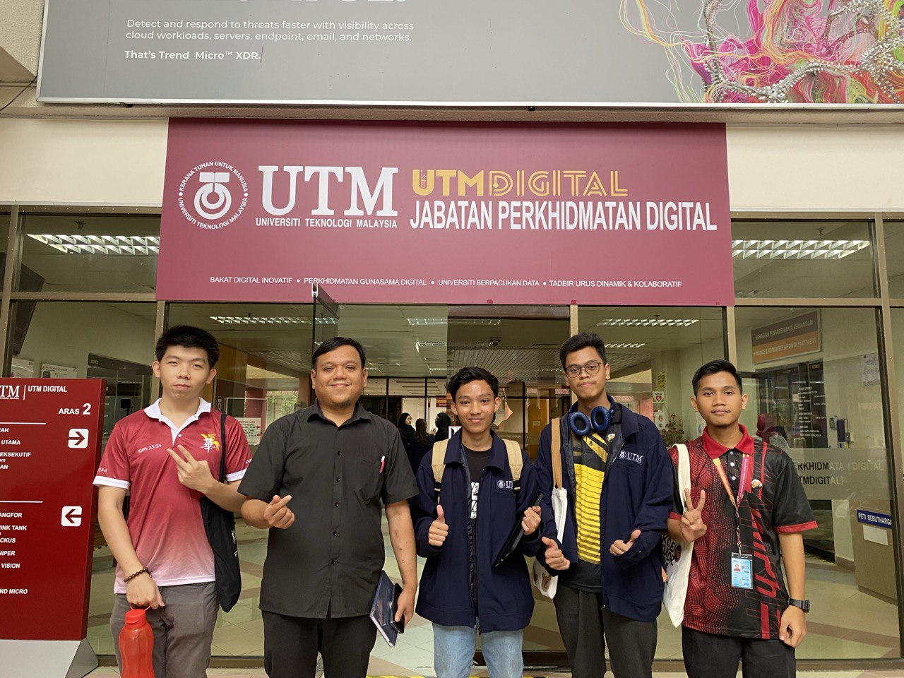

<html>
  <body>
    <!--Contents-->
                            <h2 id="Title">Industry Visit 1</h2> 
                                
                                
                                
                                
                                
<u>10 December 2024</u> 
                                    

                                         
For Assignment 2, which is Industry Visit 1, we conducted an industry visit at UTMDigital. UTMDigital is a division within the University of Technology Malaysia (UTM) that focuses on digital transformation and innovation.UTMDigital is one of the Core Enablers that plays a very important role indriving UTM towards the success of the Digital University agenda. UTMDigital as the Leader of the Digital University functions as an organization that provides digital services including infostructure and ICT infrastructure to all campus residents.
                                        
During the visit, we were exposed to how UTM Digital supports UTM in various aspects, including student data management and campus facilities. UTMDigital plays a key role through systems like the Digital Care unit, which provides technical support, and the MyUTM site, which offers a centralized platform for university services. 
                                        
We also learned about the UTMSmart app, which enhances campus life with smart services, and the Data Centre, which ensures secure and efficient management of university data. Additionally, UTMDigital helps maintain facilities such as UTMWiFi, ensuring seamless connectivity across the campus. This visit provided valuable insights into how UTMDigital's technologies improve operational efficiency and the overall student experience at UTM.
                                        
Reflecting on the visit to UTMDigital, I gained a deeper understanding of how technology plays a crucial role in enhancing university operations and student experience. I was particularly impressed by how UTMDigital integrates various digital solutions, such as the MyUTM site, UTMSmart app, and the Data Centre, to streamline services and ensure efficient management of resources.
                                        
The visit also highlighted the importance of the Digital Care unit in providing continuous support for both students and staff, and how systems like UTMWiFi contribute to the university’s goal of building a connected and technology-oriented campus. This visit gave me a better understanding of how digital technologies can make a real difference in education. It also made me excited about the possibility of using similar technologies in other industries to improve efficiency and drive progress.
                                        

                                

  </body>
</html>