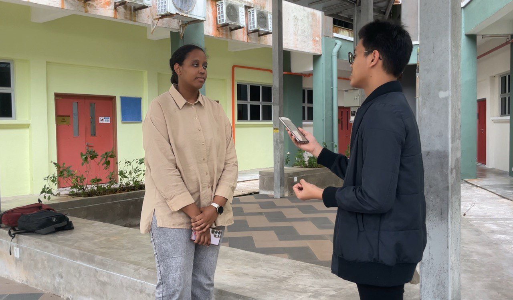
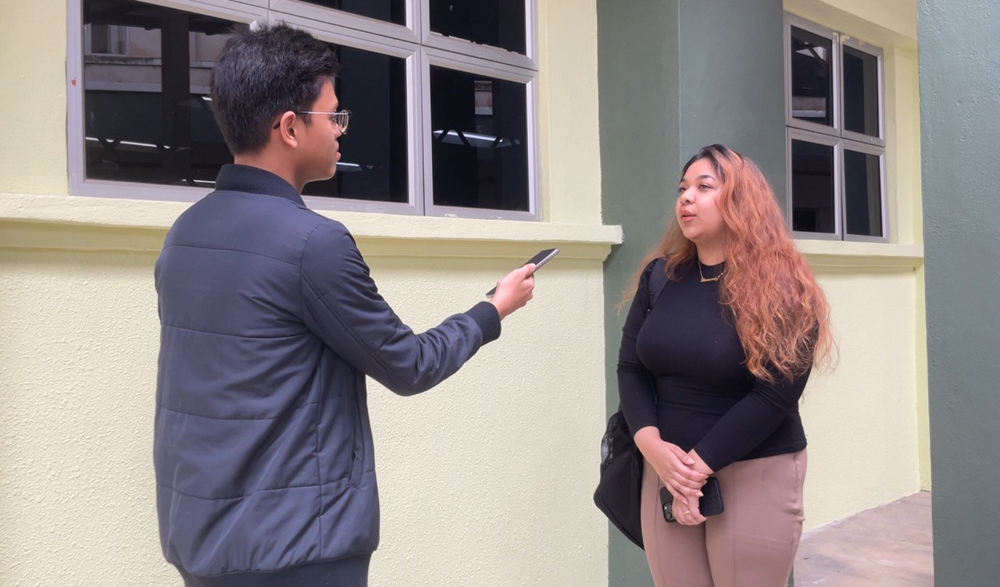
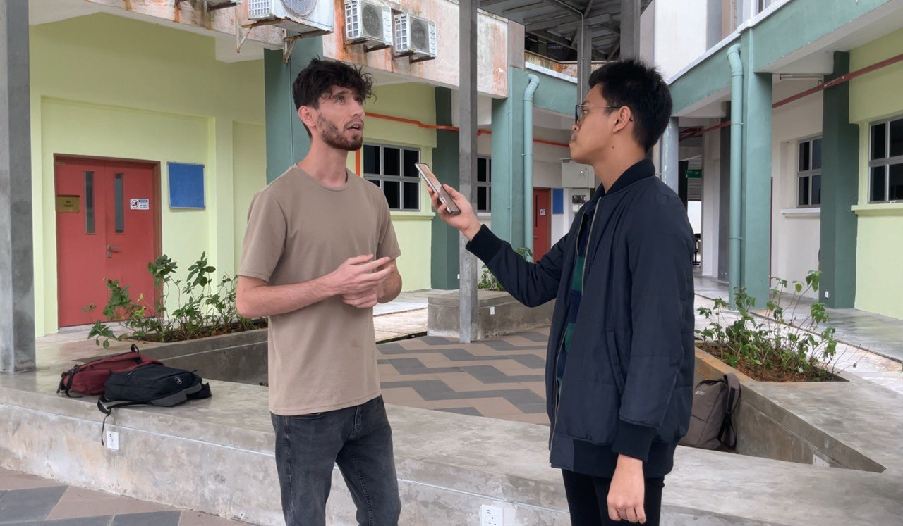
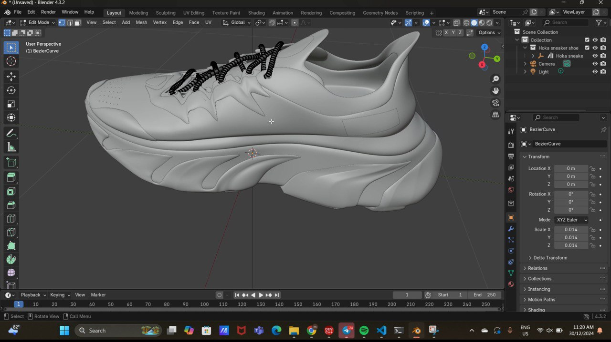
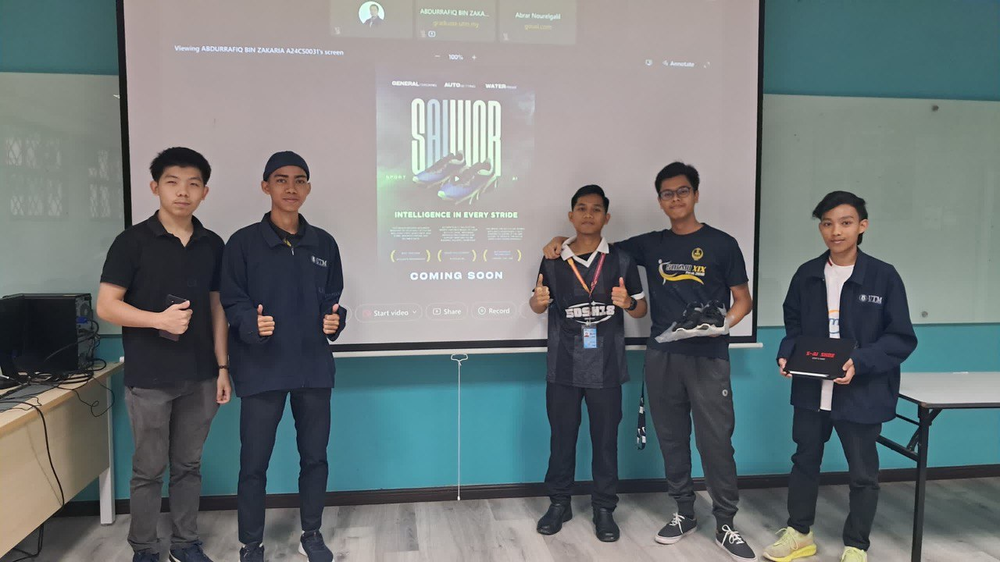

<html>
  <body>
    <!--Contents-->
                            <h2 id="Title">Design Thinking (Low Fidelity Prototype)</h2> 
                                
                                
                                
                                
                                
                                
<u>08 January 2025</u> 
                                    

                                         
 &emsp; For our Design Thinking project, we are developing an AI-powered sports shoe integrated with IoT technology. The shoe will these features:
                                            <ul>
                                                 <li>Performance tracking</li>
                                                <li>Automatic adjustments</li>
                                                <li>Waterproofing</li>
                                            </ul> The performance tracking will monitor key metrics like distance, speed, and heart rate to help athletes optimize their training. The automatic setting feature will adjust the shoe's fit based on movement, ensuring comfort and support. Additionally, the waterproofing technology makes it ideal for various weather conditions.By combining AI and IoT, we aim to create a smart sports shoe that enhances performance and provides valuable insights for athletes.
                                            
Reflecting on this project, I learned how AI and IoT can significantly enhance everyday products, such as sports shoes, by improving performance and user experience. The process pushed me to think creatively about how technology can address real-world needs and how to design a product that is both functional and user-friendly.
                                            
Working on this project allowed me to explore various aspects of design thinking, from ideation to prototyping, and consider the practical needs of users. I also learned the importance of balancing innovation with usability, ensuring that the technology enhances the product without overwhelming the user.
                                            
In terms of improvement, I believe we could further explore the shoe's customization options, allowing users to personalize settings based on their unique preferences and needs. Additionally, incorporating a longer battery life for the IoT features would make the product even more practical.
                                            
Overall, this project has inspired me to continue exploring the intersection of technology and design, and I’m excited about the potential for smart products to make a real impact in various industries.
                                        

                                

  </body>
</html>