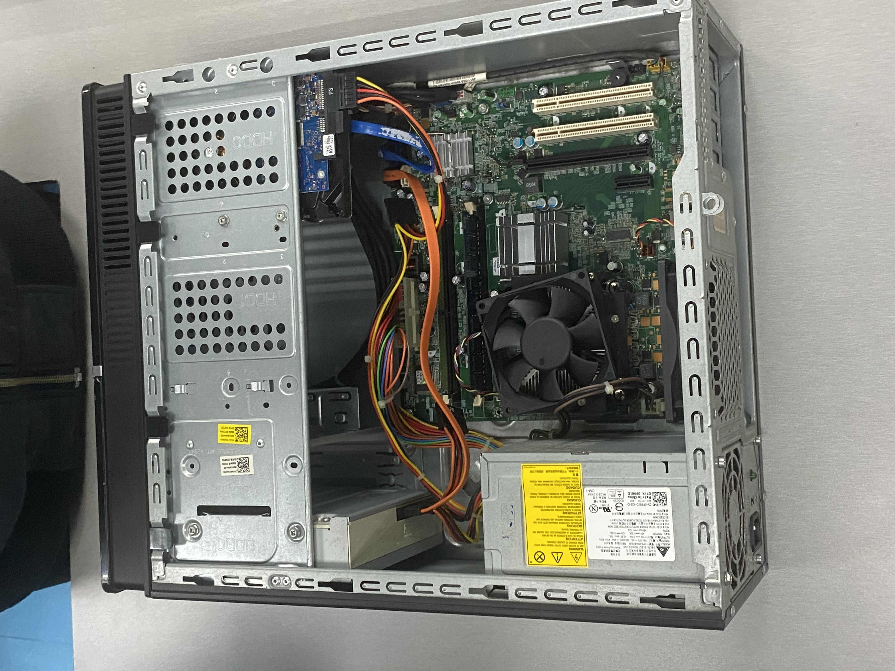
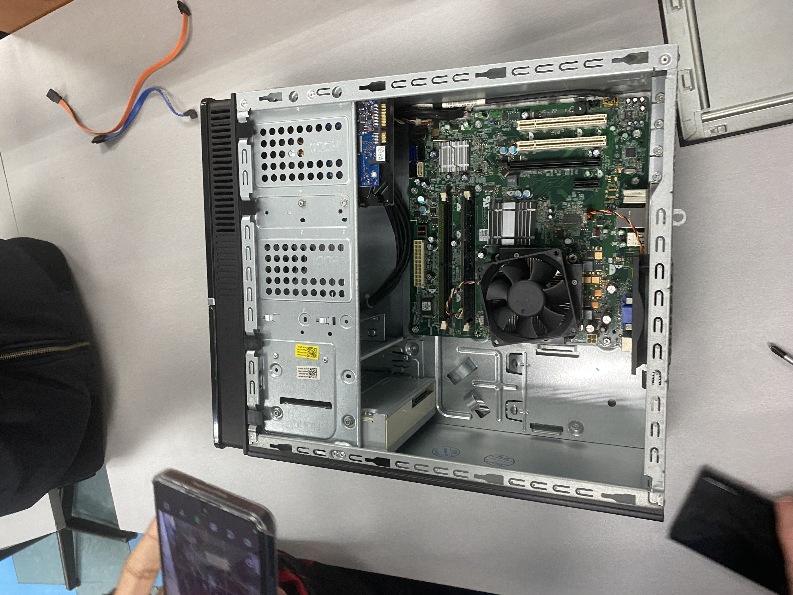
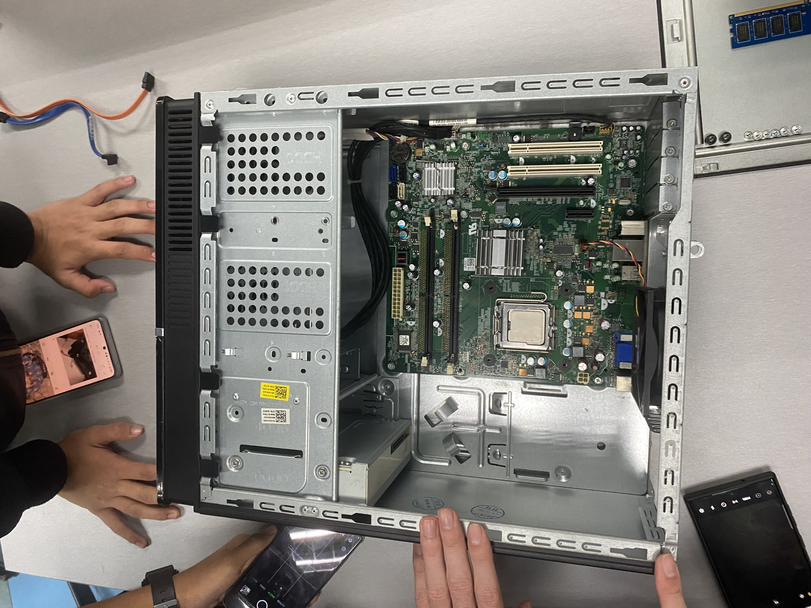

<html>
  <body>
    <!--Contents-->
                            <h2 id="Title">PC Assemble</h2> 
                                
                                
                                
                                
<u>06 November 2024</u> 
                                    

                                         
 &emsp;  I had the opportunity to engage in a hands-on session of PC assembling and disassembling. I gained a much deeper understanding of the inner workings of a computer as I progressed through the process.

                                        Throughout the session, I learned how each part of the PC is interconnected and how crucial it is to handle each component with care. I was introduced to the step-by-step procedure, from opening the case and disconnecting all the cables to removing the power supply, RAM, hard disk, and CPU fan.This hands-on experience taught me to pay attention to detail required when assembling or disassembling a computer.

                                        Reflecting on the experience, I now feel more confident in handling PC hardware. The session not only enhanced my technical skills but also provided me with a deeper understanding of the details of computer architecture.

                                        Below are the steps to disassemble a PC :

                                            <ul>
                                                 <li>Open the case</li>
                                                <li>Disconnect all the connected wires.</li>
                                                <li>Remove the power supply</li>
                                                <li>Remove off the RAM</li>
                                                <li>Remove the Hard Disk</li>
                                                <li>Remove the CPU fan</li>
                                            </ul> 
                                            To reassemble, just reverse the steps. Hopefully, it runs well.
                                            After the lab, we are going to take a quiz about what we learned before. It's easy if you remember the steps.
                                        

                                

  </body>
</html>